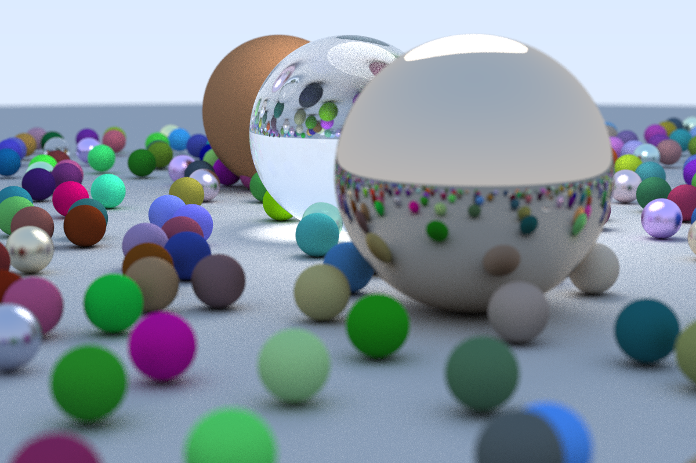

# Go Ray Tracer

A path tracer implemented in Go, based on the foundational architecture described in **"Ray Tracing in One Weekend"** by Peter Shirley. This project explores the fundamental geometry, physics, and computer science principles required to generate photorealistic images from scratch without a graphics API.

## Theoretical Foundations

This implementation follows the logic of a **Path Tracer**, a general form of ray tracing that simulates the indirect lighting found in modern cinema.

### Geometry and Vectors
The engine relies heavily on vector algebra. We use a `vec3` class to represent colors, locations, directions, and offsets interchangeably.
* **Vector Basics**: Operations such as dot products and cross products are the "under the hood" tools for all spatial calculations.
* **The Ray Equation**: A ray is defined as a function $p(t) = A + tB$, where $A$ is the origin, $B$ is the direction, and $t$ is a real number parameter. By plugging in different values for $t$, we move along the 3D line; positive $t$ values represent the "half-line" in front of the camera.

### Sphere Intersection
Spheres are used as primary geometric primitives because their intersection math is straightforward.
* **The Equation**: In vector form, a point $p$ is on a sphere with center $C$ and radius $R$ if $dot((p-C), (p-C)) = R^2$.
* **The Quadratic Solution**: Substituting the ray equation into the sphere equation yields a quadratic in $t$: $t^2 \cdot dot(B,B) + 2t \cdot dot(B, A-C) + dot(A-C, A-C) - R^2 = 0$.
* **Roots and Hits**: The discriminant of this quadratic determines if the ray misses (0 roots), grazes (1 root), or passes through (2 roots) the sphere.

### Materials and Light
The project implements an abstract material system where each material dictates how a ray interacts with a surface.
* **Lambertian (Diffuse)**: These matte surfaces randomize the direction of reflected rays. The algorithm picks a random point $s$ in a unit sphere tangent to the hit point and sends a new ray toward it.
* **Metal**: Reflections are calculated using the vector formula $v - 2 \cdot dot(v, n) \cdot n$. A "fuzz" factor can be added to simulate rougher metals by perturbing the reflection direction.
* **Dielectrics**: Clear materials like glass split light into reflected and refracted rays using **Snell's Law**. We use **Schlick's Approximation** to vary reflectivity based on the viewing angle, making glass look more like a mirror at steep angles.
* **Light Emitters**: Lighting can be added implicitly by making objects emit their own color, which then contributes to the final pixel through scattering.

## Project Architecture

This Go implementation organizes the tutorial's logic into modular packages:

* **/geo**: Contains `vec3` and `ray` primitives for core math.
* **/model**: Defines the `Hittable` interface and specific shapes like `Sphere`.
* **/camera**: Implements a positionable camera with adjustable Field of View (FOV) and defocus blur (depth of field).
* **/scene**: Logic for building complex worlds, including the high-count "Random Scene" cover image.
* **/render**: Handles the path tracing loop and antialiasing by averaging multiple samples per pixel.

## Final Render & Performance

The image below was generated using a high-density scene with hundreds of random spheres. To manage performance, a **Bounding Volume Hierarchy (BVH)** was implemented, which reduces the intersection search from linear $O(N)$ to logarithmic $O(log N)$ complexity.

### Performance Benchmarks
**Configuration**:
* **Resolution**: 1200x800
* **Samples**: 100
* **Max Depth**: 50
* **FOV**: 20.0°

**Average Render Time**: ~1 minute 6 seconds



## Usage

### With threads
```bash
go run main.go -mode=threads
```

### With MPI
```bash
go build -o ray-tracer .
mpirun --map-by :OVERSUBSCRIBE -n 24 ./ray-tracer -mode=mpi
```
